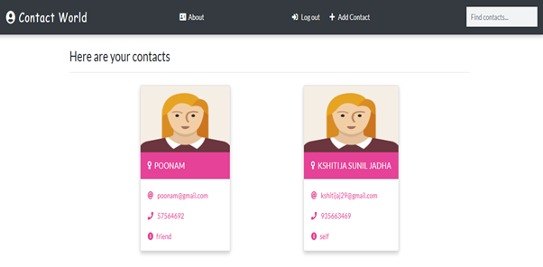

# Contact World Web application
*My Contact World Web application is a Django project. Here, in this Web application, you can perform the actions that you usually see in the contact app.*

# Installation process
**After downloading or cloning follow these instructions**

**Go to project files**
> python -m venv venv

> source env\Scripts\activate

> cd contacts

> pip install -r requirements.txt

> python manage.py makemigrations

> python manage.py migrate

> python manage.py runserver

# Features
- Register
- Login
- Add Contact
- Update Contact
- Delete Contact
- Individual profile
- Logout
- User-friendly

Good Luck :)

# Tools
## Front-end Part
* HTML
* CSS
* Bootstrap
## Back-end
* Django
* MY SQL

# Screenshots of the Project

  
  
  

